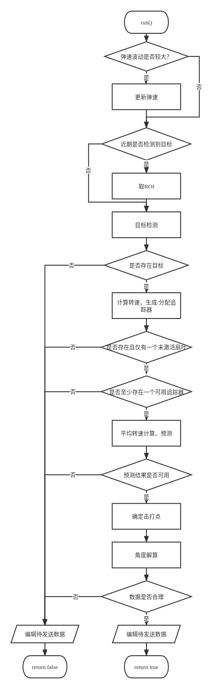

# Copyright(C),2018-2022,沈阳航空航天大学T-UP战队 All Rights Reserved
# Buff Module
## Author: 顾昊 guhao0521@gmail.com
# 1. 简介
Buff模块是能量机关任务模块，负责处理能量机关的识别与预测任务。
# 2.文件结构
├── detector   
│   ├── inference.cpp   //推理cpp文件   
│   └── inference.h     //推理头文件   
└── predictor    
│   ├── predictor.cpp   //预测器cpp文件   
│   └── predictor.h     //预测器头文件   
├── fan_tracker.cpp     //扇叶trackercpp文件   
├── fan_tracker.h       //扇叶tracker头文件   
├── buff.cpp            //能量机关cpp文件   
├── buff.h              //能量机关头文件   
├── CMakeLists.txt      //模块CMake文件（已弃用）   
└── README.md           //文档

# 3.流程图   
  
# 4.部分技术细节详解
## 1.转速求解
在求解能量机关转速这一方面，我们采用了用两帧扇叶间旋转矩阵来求解轴角的这一方式。  
轴角作为一种表示刚体旋转的方式，由旋转轴和旋转角度组成。显然当测量较为准确时，轴角的旋转轴就是能量机关的旋转轴，角度则是两帧间能量机关旋转过的角度。
## 2.大能量机关预测
大能量机关采取函数拟合的方法进行预测。
函数拟合部分直接调用第三方库Ceres，使用Ceres库进行非线性最小二乘拟合。  
拟合的目标函数为$y = a sin(\omega x + \theta) + b$，分为两个阶段：  

第一阶段是整个函数的拟合，共$a,b,\omega,\theta$四个参数需要拟合。该阶段由于拟合参数多，耗时较长，帧率会有显著降低，暂未到达可以进行打击的阶段。  

第一阶段后则是第二阶段，该阶段下假设原函数拟合基本正确，经过我们的测试，只有相位上可能稍有一定偏差。因此，第二阶段我们只对$\theta$进行拟合。同时由于只需拟合相位一个参数，拟合残差项数也相应减少，这一阶段会在击打大符时一直持续，当使用新相位带入函数中所得的RMSE更小时，选用此相位替换原函数中的相位。
## 2.不足与展望
[1]目前的网络模型对大符中心点的识别存在较大的误差，这显然会为角速度的测量引入较大的噪声，可以进行进一步的数据集标注并进行更多的训练来缓解该问题。
# 5.参考文献
[1]Google (2010) Ceres Solver[Docs].  
http://ceres-solver.org/index.html
