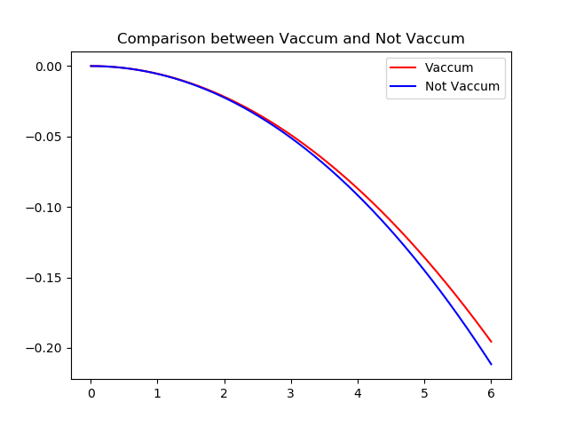

# Copyright(C),2018-2022,沈阳航空航天大学T-UP战队 All Rights Reserved
# CoordSolver Module
## Author: 顾昊 guhao0521@gmail.com
# 1. 简介
CoordSolver模块主要用于各种有关坐标系变换、解算的处理，包括但不限于PnP解算，弹道补偿（静态/动态），坐标系偏移。
# 2.文件结构
├── coordsolver.cpp cpp文件  
├── coordsolver.h 头文件  
└── README.md 说明文档  
# 3.部分技术细节详解
## 1.弹道动态补偿
### 1. 引入
显然，子弹在飞行过程中会受到重力，空气阻力等多个力的作用。在这些力的作用下，子弹的弹道呈类似抛物线，一般来说，我们有两种方式进行弹道补偿，一种是解算弹道方程，另一种则是直接拟合，这两种方法各有其各有长短:  
|  |优点|缺点|
|--|---|---|
|拟合|类似射表，计算迅速，结果鲁棒|需要大量测试，耗费大量时间|
|解算弹道方程|基于弹道学模型，较为精确|计算量较大，不便于理解|

在2021赛季我们采取的是传统的拟合方法，但这样的方法需要大量的测试，
且变量较多时或该实际运用时某变量发生改变，且这个值并未经过拟合，拟合的结果不一定具有物理学意义，存在一定的风险，因此，我们采用使用四阶龙格-库塔法与迭代法求解弹道学微分方程的方法来解算弹道所需的补偿值。  

    
图为6m距离，30m/s弹速下小弹丸考虑空气阻力与不考虑空气阻力的弹道仿真对比。
### 2.数学原理
弹丸飞行时主要收到空气阻力和重力两个力的作用:
>$F_g = mg$  
>$F_f = \frac{1}{2}C{\rho}Sv^2$  

$F_g$方向竖直向下，$F_f$方向与弹丸速度方向相反。由这两个式子，我们能很轻松的推导出加速度的表达式:

>$a_g = g$  
>$a_f = \frac{\frac{1}{2}C{\rho}Sv^2}{m}$  

令$k = \frac{\frac{1}{2}C{\rho}S}{m}$,则有:
>$a_f = kV^2$  

根据上面的式子，我们可以列出如下的微分方程组：

>$$\begin{cases}
    \frac{du}{dt} = -kv^2*cos\theta \\
    \frac{dw}{dt} = -kv^2*sin\theta - g \\
    \frac{dx}{dt} = u \\
    \frac{dy}{dt} = w \\
    v = \sqrt{u^2 + w^2}
\end{cases}$$

化简

>$$\begin{cases}
    \frac{du}{dt} = -kuv \\
    \frac{dw}{dt} = -kwv - g \\
    \frac{dx}{dt} = u \\
    \frac{dy}{dt} = w \\
    v = \sqrt{u^2 + w^2}
\end{cases}$$

上述式子是$u,w,x,y$关于自变量$t$的微分方程组，即自然坐标系的弹丸质心运动微分方程组，当$u,w,x,y$初值给定，弹道唯一确定。此时方程组自变量为$t$，已经可以用来求解。

但不难注意到，$t$作为一个自变量，且该微分方程组没有解析解，我们很难确定$t$在到达目标位置时的值,但若是以$x$为自变量，在目标静止的前提下，该值显然唯一确定。在自然坐标系下有$\frac{dy}{dx} = p$, $p$即为目前弹丸质心的运动方向。$\lim_{t \to 0^+}{p = \frac{u_0} {v_0} = tan\theta_0}$。
>$$\begin{cases}
    \frac{du}{dx} = -ku*\sqrt{1 + p^2} \\
    \frac{dp}{dx} = \frac{-g}{u^2} \\
    \frac{dy}{dx} = p
\end{cases}$$

化简

>$$\begin{cases}
    \frac{du}{dx} = -kv \\
    \frac{dp}{dx} = \frac{-g}{u^2} \\
    \frac{dy}{dx} = p \\
    \frac{dt}{dx} = \frac{1}{u} \\
    v = u\sqrt{1 + p^2}
\end{cases}$$

上式是$u,p,y,t$即为关于自变量$x$的微分方程组。我们可以通过迭代法，通过改变$\theta_0$的大小来调整弹道，最终让弹道经过目标位置，获取所需的补偿角度。

### 3.不足与展望
I.不难看出，$u,w,x,y$关于自变量$t$的这一形式的微分方程组，形式上便于理解，只是相比$u,p,y,t$关于自变量$x$在工程实现上需要更多的处理。之后可以进一步的引入目标的运动,实现精确的提前量给定。 

II.由于没有风洞之类的设施，$k$值无法精确测得，只能靠大致估算。弹丸阻力系数C取小弹丸阻力系数$C = 0.47$,大弹丸$C = 0.275$,空气密度取$\rho = 1.169kg/m^3$，并带入
$k = \frac{\frac{1}{2}C{\rho}S}{m}$进行计算。  
得大弹丸$k = 0.00556$，发光大弹丸$k = 0.00530$，小弹丸$k = 0.01903$。

# 4.参考文献
[1]Robomaster (2019) RoboRTS—Tutorial[PDF].  
https://github.com/RoboMaster/RoboRTS-Tutorial/blob/master/pdf/projectile_model.pdf  
[2]钱林方.火炮弹道学[M].北京:北京理工大学出版社,2016
