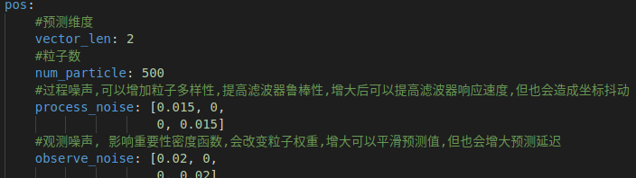

# Copyright(C),2018-2022,沈阳航空航天大学T-UP战队 All Rights Reserved
# Filter Module
## Author: 顾昊 guhao0521@gmail.com
# 1. 简介
Filter模块是滤波任务模块，包含滤波器声明和实现。
# 2.文件结构
├── particle_filter.cpp //粒子滤波cpp文件   
├── particle_filter.h   //粒子滤波头文件   
└── README.md           //文档    
# 3.部分技术细节详解
## 1.粒子滤波
### 1.介绍
粒子滤波(Particle Filter))的思想基于蒙特卡洛方法(Monte Carlo methods)，它是利用粒子集来表示概率，可以用在任何形式的状态空间模型上。在非线性系统相比卡尔曼滤波具有较大的优越性。很适合用来对坐标这种非线性的变量进行滤波。    
本程序中的粒子滤波使用Eigen库实现，噪声仍采用高斯假设，假设各维度噪声相互独立。程序经过矩阵化计算优化，速度较快。
### 2.调参
可以直接参考下图:   
    
`vector_len`:所需预测量的维度，但需注意维度灾难的存在，高维空间下样本的稀疏性会使得滤波器效果显著降低。   
`num_particle`:字面意思，粒子的数量，理论上来说粒子数越大效果越好，粒子数量为无穷时即为真实分布。  
`process_noise`:过程噪声矩阵，会在重采样时为粒子叠上方差为该矩阵对角线元素的高斯分布，以求增加粒子多样性。   
`observe_noise`:观测噪声矩阵，对角线元素即为重要性采样函数（高斯分布右半侧）的协方差。一般来说，不超过过程噪声的两倍

## 3.不足与展望
[1]目前的程序中，重采样十分频繁。但显然当目标运动状态改变不十分剧烈的时候，没有必要进行重采样，目前的样本即可较好的表示出目标分布，这种时候重采样只会使得目标产生不必要的抖动。   
[2]添加过程噪声的方法十分粗暴，没有考虑到目标权重的影响，可以考虑为权重大的目标添加较小的噪声，以求减小抖动。
# 5.参考文献
[1]Sebastian Thurn et al.Probabilistic Robotics[M].Boston.The MIT Press,2000
